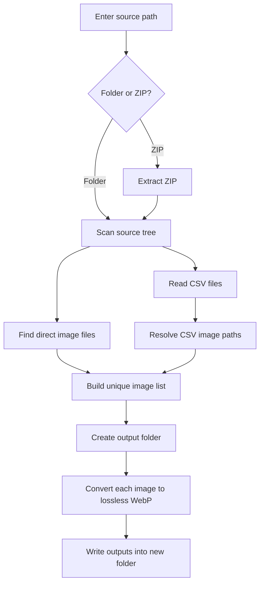

# Anas Compression Script

Local browser-based tool for scanning a folder or zip file, finding images directly or through CSV references, and converting them into lossless WebP files inside a new output folder you choose.

## What It Does

You give the app:

1. A source path
   - folder path, or
   - `.zip` path
2. An output base path
3. A new output folder name

The app then:

- scans the source recursively
- finds direct image files
- reads CSV files and resolves image paths referenced in CSV cells
- converts discovered images to lossless WebP
- writes everything into a newly created output folder

## Visual Flow



## Output Behavior

All converted files are written under:

`output base path/output folder name`

### Direct image files

Directly discovered images preserve their relative source subfolder structure inside the output folder.

Example:

```text
Source:
C:\Users\bhagy\Downloads\Florida\images\photo1.png

Output:
C:\Users\bhagy\Downloads\Florida WebP\images\photo1_lossless.webp
```

### CSV-referenced image files

If an image is discovered through a CSV file, the output is grouped under the CSV file's relative subfolder inside the output folder.

### File naming

Each converted image is written as:

`originalname_lossless.webp`

## Supported Inputs

### Source path

- folder path
- `.zip` file path

### Image types

- `.jpg`
- `.jpeg`
- `.png`
- `.bmp`
- `.tif`
- `.tiff`
- `.gif`
- `.webp`

### CSV behavior

The app scans CSV files and looks for cells that contain image paths. It supports:

- absolute image paths
- relative image paths near the CSV
- relative image paths under the scanned source tree

## Project Structure

```text
anas-compression-script/
├── backend/
│   └── server.py
├── frontend/
│   ├── app.js
│   ├── index.html
│   └── styles.css
├── requirements.txt
├── start.bat
└── README.md
```

## How To Run

### 1. Start the app

```bat
start.bat
```

`start.bat` will:

- detect `py` or `python`
- try to create a local `.venv` in the repo
- fall back to the system Python if `.venv` creation is unavailable
- install dependencies from `requirements.txt`
- start the local server

### 2. Open the UI

```text
http://127.0.0.1:8876
```

### 3. Fill the form

- `Source path`
- `Output base path`
- `Output folder name`

### 4. Click `Scan Folder`

The app will show:

- number of direct images found
- number of CSV-referenced images found
- total unique images
- planned output paths

### 5. Click `Convert All To Lossless WebP`

The app will create the WebP files in the output folder.

## Example Usage

### Example 1: Folder source

```text
Source path:
C:\Users\bhagy\Pictures\California

Output base path:
C:\Users\bhagy\Downloads

Output folder name:
California WebP
```

### Example 2: ZIP source

```text
Source path:
C:\Users\bhagy\Downloads\Lake Eola Heights Orlando FL-20260307T092658Z-3-001.zip

Output base path:
C:\Users\bhagy\Downloads

Output folder name:
Florida WebP
```

## Tech Stack

- Frontend: plain HTML, CSS, JavaScript
- Backend: Python standard library HTTP server
- Image conversion: Pillow

## Vercel Compatibility

### Short answer

No, it will not work the same on Vercel.

### Why not

This app depends on local machine filesystem behavior:

- reading Windows paths like `C:\Users\bhagy\...`
- scanning local directories recursively
- opening local ZIP files from the machine
- creating output folders on the machine
- writing converted files back to the machine

Vercel does not behave like a local desktop app. It runs serverless/web workloads, not long-lived local filesystem tools.

### Main blockers on Vercel

1. No access to your local Windows filesystem
   - Vercel cannot read `C:\Users\bhagy\...` on your machine.

2. Ephemeral filesystem
   - even if files are uploaded, writes are temporary and not suitable for this same workflow.

3. Current backend is a local Python server
   - this app expects a persistent local HTTP server on `127.0.0.1:8876`.

4. ZIP and output-folder workflow is desktop-oriented
   - the current product assumes local source and local destination paths.

### What would work on Vercel instead

You would need a different product model:

- upload zip/folder contents through the browser
- process uploads in a hosted backend
- return downloadable output zip files
- store intermediate/output files in cloud storage

That would be a web app version, not the same local-path version.

### Recommendation

If your goal is:

- enter local Windows paths
- read local files
- create local output folders

then keep this as a local app, or package it later as:

- Electron desktop app
- Tauri desktop app
- local-only Python GUI app

## Notes

- Someone cloning the repo can run it from the project root with `start.bat`.
- Prerequisite: Python 3.11+ with pip available as `py` or `python`.
- First run needs internet access to install Pillow from `requirements.txt`.
- ZIP files are extracted automatically before scanning.
- Output folders are created automatically if needed.
- The app writes lossless WebP using Pillow.
- Existing outputs with the same name will be overwritten by a new conversion.

## Public Repo

GitHub:

`https://github.com/beherebhagyesh/anas-compression-script`
