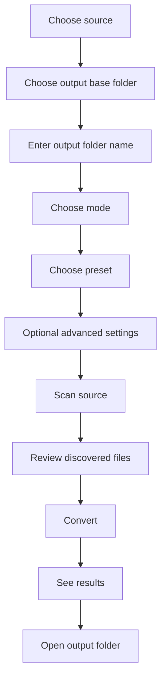

# Product Spec

## Purpose

Define the intended product behavior for the compression tool before it is turned into a packaged desktop app.

This spec focuses on:

- user-facing behavior
- conversion modes
- presets
- advanced settings
- output rules
- error handling

## Product Summary

The app is a local-file conversion tool for non-technical users.

Users should be able to:

- select a source folder or zip
- choose an output location
- choose how files should be compressed or converted
- run the conversion
- review the output

The app should hide technical complexity by default and expose only the controls needed for common use cases.

## User Types

### Primary user

- non-technical operator
- wants smaller image files
- may not know what WebP, lossy, or metadata stripping means
- expects a normal desktop-app experience

### Secondary user

- advanced user
- wants exact format control
- wants target file size or resizing behavior

## Core Jobs To Be Done

1. Make files smaller without changing their type.
2. Convert files to WebP for web use.
3. Convert files and compress them.
4. Try to get files under a maximum size threshold.
5. Process a whole folder or zip at once.

## Input Model

The app accepts:

- source folder
- source zip file

Source discovery rules:

- scan subfolders recursively
- discover direct image files
- read CSV files in the source tree
- resolve image paths from CSV cells where possible

## Supported Formats

### Input formats

- JPG
- JPEG
- PNG
- WebP
- BMP
- TIFF
- GIF

### Output formats for MVP

- JPG
- PNG
- WebP

## Main Workflow

## Required Main Inputs

### 1. Source path

Accepted:

- folder
- zip file

Behavior:

- if folder: scan directly
- if zip: extract first, then scan extracted contents

### 2. Output base path

Behavior:

- must exist
- user chooses where outputs should be created

### 3. Output folder name

Behavior:

- app creates this folder under the output base path
- this becomes the conversion root for all generated files

## Conversion Modes

These should be visible in the main UI.

### Mode 1: Keep format, compress

Purpose:

- reduce size without changing file type

Expected behavior:

- JPG -> JPG
- PNG -> PNG
- WebP -> WebP

MVP note:

- if unsupported input cannot reasonably keep format, app should warn and skip or require another mode

### Mode 2: Convert to WebP

Purpose:

- standardize outputs to WebP

Expected behavior:

- supported input -> WebP

User options:

- lossless
- lossy

### Mode 3: Convert and compress

Purpose:

- both convert and optimize for smaller output

Expected behavior:

- supported input -> chosen target format
- apply quality reduction and optional resizing

Allowed MVP outputs:

- WebP
- JPG

## Presets

Presets should be the main non-technical choice.

### Preset 1: Lossless

Intent:

- preserve quality as much as possible

Behavior:

- lossless if supported by output format
- no aggressive resizing

### Preset 2: Balanced

Intent:

- smaller files with visually safe quality

Behavior:

- moderate quality reduction
- optional mild resizing for large images

### Preset 3: Small file

Intent:

- noticeably smaller outputs for upload or sharing

Behavior:

- stronger quality reduction
- allow moderate downscaling

### Future presets

- Under 200 KB
- Under 50 KB
- Thumbnail

These may be added after the MVP.

## Advanced Settings

These should be hidden behind an advanced toggle.

### Output format

Allowed values:

- keep original
- WebP
- JPG
- PNG

### Compression type

Allowed values:

- lossless
- lossy

### Quality

Range:

- 1 to 100

Applies mostly to:

- JPG
- WebP

### Resize

Fields:

- max width
- max height

Behavior:

- keep aspect ratio
- never upscale

### Target size

Field:

- target max KB

Behavior:

- optional
- iterative encode loop
- may return closest possible result if target is unreachable

### Metadata

Allowed values:

- keep metadata
- strip metadata

### Overwrite behavior

Allowed values:

- overwrite existing output
- create separate suffixed output later

MVP default:

- overwrite matching generated filename

## Output Rules

All outputs are written under:

`output_base_path/output_folder_name`

### Structure preservation

For direct file discovery:

- preserve relative source folder structure inside output root

For CSV-discovered files:

- group outputs under the CSV file's relative subfolder inside the output root

### Output naming

MVP default suffixes:

- keep format compress -> `_compressed`
- convert to WebP lossless -> `_lossless`
- convert to WebP lossy -> `_webp`
- convert and compress -> `_optimized`

### Extension behavior

- output extension must match actual encoded format

Examples:

- `photo_compressed.jpg`
- `banner_lossless.webp`
- `hero_optimized.jpg`

## Scan Results View

Before conversion, the user should see:

- direct images found
- CSV-referenced images found
- total unique images
- output root path
- per-file planned output path

## Conversion Results View

After conversion, the user should see:

- file name
- source format
- output format
- original file size
- output file size
- percent reduction
- warnings or fallback notes
- success or failed status

## Error Handling

Errors must be understandable to non-technical users.

### Good user-facing errors

- source path not found
- output folder could not be created
- no supported images found
- file could not be read
- file could not be converted
- target size could not be reached

### Avoid exposing raw stack traces

Raw internal exceptions should not be shown directly in the desktop app UI.

## ZIP Behavior

When the source is a zip:

- extract into a working folder
- scan extracted contents
- do not write outputs back into the zip
- write outputs only into the chosen output root

## CSV Behavior

When scanning CSV files:

- inspect cell values
- detect likely image paths
- resolve absolute paths directly
- try relative paths from CSV folder
- try relative paths from source root

If a CSV image reference cannot be resolved:

- skip it
- report as unresolved in logs or warnings later

## Performance Requirements

For MVP:

- work correctly before optimizing heavily
- support normal batch folder runs
- do not freeze the UI during long conversions

Later improvements:

- progress bar
- cancellation
- parallel processing controls

## Acceptance Criteria For MVP

The MVP is acceptable when:

1. User can choose a folder or zip source.
2. User can choose an output base folder and output folder name.
3. User can choose among:
   - keep format compress
   - convert to WebP
   - convert and compress
4. User can choose among:
   - Lossless
   - Balanced
   - Small file
5. App scans direct and CSV-discovered images.
6. App writes outputs into one created output root.
7. App shows conversion results with size reduction.
8. App works without terminal use in the final packaged form.

## Out Of Scope For MVP

- cloud deployment
- browser-only hosted deployment
- AVIF support
- drag-and-drop
- exact file-size guarantees for every image
- multi-user collaboration
- authentication

## Recommended Next Docs

After this spec:

- `docs/ROADMAP.md`
- `docs/TAURI_PLAN.md`
- `docs/INSTALL_NOTES.md`
- `docs/RELEASE_PROCESS.md`
