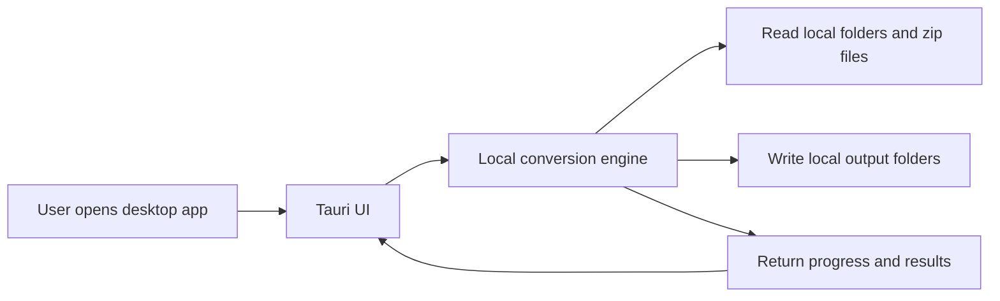
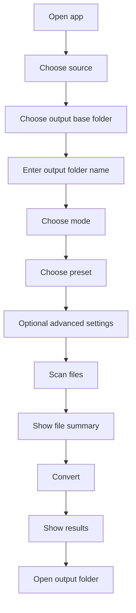

# Tauri Plan

## Goal

Turn the current local compression tool into a real desktop app for non-technical users.

Success means:

- user downloads one installer
- user installs like a normal Windows app
- user opens the app from Start Menu or desktop
- user never needs Python, Git, PowerShell, localhost URLs, or manual dependency setup

## Why Tauri

Tauri is a better fit than the current repo-run model because:

- it produces a real desktop app
- installer size is much smaller than Electron
- it gives native file-system access through the desktop app model
- it is a better fit for path-based local file workflows

## Product Constraint

This tool is fundamentally local-file driven:

- local folder input
- local zip input
- local output folder creation
- local image processing

That means the right target is a desktop app, not a hosted web app.

## Current Architecture

Today the app is:

- plain HTML/CSS/JS frontend
- local Python HTTP server
- Pillow-based image conversion
- started through `start.bat`

This is acceptable as a prototype, but not acceptable for non-technical users.

## Target Architecture

Preferred Tauri architecture:

## Two Implementation Paths

There are two realistic ways to get to Tauri.

### Path A: Tauri + existing Python backend

Flow:

- Tauri launches the frontend
- Tauri starts the Python backend locally
- frontend talks to the local Python service
- Python continues doing conversion

Pros:

- fastest path from current prototype
- reuse most existing backend logic
- lower short-term engineering cost

Cons:

- packaging Python is messy
- installer complexity increases
- cross-machine reliability is worse
- hidden local subprocess management becomes a source of bugs

### Path B: Tauri + native Rust conversion engine

Flow:

- Tauri frontend uses native commands or Rust backend calls
- Rust handles file discovery, zip extraction, conversion orchestration, and output writing
- no Python dependency at runtime

Pros:

- best end-user experience
- true one-step installer
- no Python prerequisite
- cleaner long-term architecture

Cons:

- more engineering work up front
- image-processing logic must be reimplemented or wrapped carefully

## Recommended Path

Recommended:

- use Path A only as a temporary bridge if speed is critical
- target Path B as the real product direction

If the goal is truly non-technical users, Path B is the correct architecture.

## Recommended Release Strategy

### Stage 1: Product stabilization

Before Tauri packaging:

- finish the conversion modes
- finish presets
- finish target-size behavior
- finalize output naming rules

Do not package unstable behavior.

### Stage 2: Tauri shell

Build the desktop shell with:

- source picker
- output picker
- mode selector
- preset selector
- advanced settings drawer
- progress panel
- results table

### Stage 3: Conversion engine integration

Choose one:

- temporary Python integration
- direct Rust implementation

### Stage 4: Installer and release

Ship:

- Windows installer `.exe`
- app icon
- versioned releases
- simple install/use guide

## Packaging Requirements For Non-Technical Users

The final product should require only:

1. download installer
2. run installer
3. open app

It should not require:

- Python installation
- Git clone
- terminal use
- localhost knowledge
- manual pip install
- environment variables

## Minimum Tauri App Features

### Main screen

- source path picker
- output path picker
- output folder name
- conversion mode
- preset
- convert button

### Advanced panel

- output format
- quality
- lossless toggle
- max width
- max height
- target KB
- strip metadata
- overwrite behavior

### Progress and results

- files discovered
- files converted
- failures
- output size changes
- warnings

## Desktop UX Requirements

For non-technical users:

- use native file/folder pickers instead of typed paths where possible
- keep default mode simple
- hide advanced settings behind a toggle
- show friendly errors
- show exact output folder at the end
- support drag-and-drop zip or folder later if useful

## Recommended Tauri UX Flow

## Technical Work Needed Before Tauri

### 1. Define stable conversion API

Needed first:

- one options schema
- one results schema
- stable per-file result object

Without this, the desktop app will sit on moving backend behavior.

### 2. Separate UI logic from server assumptions

Current frontend assumes:

- local HTTP server
- browser-only execution

Tauri should instead work with:

- internal commands
- native dialogs
- native filesystem paths

### 3. Decide Python bridge vs Rust rewrite

This is the most important technical decision.

If using Python bridge:

- Tauri must bundle or locate Python
- app must manage subprocess lifecycle
- app must handle port conflicts or avoid ports entirely

If using Rust rewrite:

- implement discovery logic in Rust
- implement zip extraction in Rust
- implement conversion logic in Rust or call a bundled binary

## Python Bridge Plan

Use this only if speed matters more than architecture.

Possible design:

1. Tauri app starts.
2. Tauri launches bundled Python backend in background.
3. Backend binds to random local port or local IPC.
4. Frontend talks to backend.
5. On app close, Tauri shuts the backend down.

Risks:

- anti-virus false positives
- Python bundling complexity
- binary size growth
- troubleshooting difficulty

## Native Rust Plan

Preferred long-term plan:

1. Keep current frontend concepts.
2. Rebuild backend logic as Tauri commands.
3. Use Rust crates for:
   - filesystem traversal
   - zip extraction
   - image loading and encoding
4. Return structured progress updates to the UI.

Likely Rust concerns:

- image quality control behavior must match current expectations
- target-size loop needs careful implementation
- PNG optimization may need specialized handling

## Release Packaging Plan

For Windows, final release should include:

- installer executable
- app icon
- version number
- release notes

Release assets should be distributed through GitHub Releases or a normal download page.

## Suggested Documentation Set

Before shipping Tauri, the repo should contain:

- `docs/ROADMAP.md`
- `docs/SPEC.md`
- `docs/TAURI_PLAN.md`
- `docs/RELEASE_PROCESS.md`

## Recommended Build Order

1. Finish mode and preset spec.
2. Build stable conversion engine.
3. Build stable result reporting.
4. Prototype Tauri shell.
5. Integrate native file pickers.
6. Choose engine path:
   - Python bridge, or
   - Rust native
7. Build installer.
8. Test on a clean Windows machine with no Python installed.

## Clean-Machine Acceptance Test

The final app is acceptable only if this works:

1. Fresh Windows user downloads installer.
2. Installs app.
3. Opens app.
4. Selects zip or folder.
5. Selects output destination.
6. Converts files successfully.

No terminal, Python, or manual repair should be needed.

## Recommendation

Short term:

- keep iterating on the current prototype until mode behavior is stable

Medium term:

- begin Tauri shell work only after conversion options settle

Long term:

- move to a Python-free packaged desktop app if the audience is non-technical users
